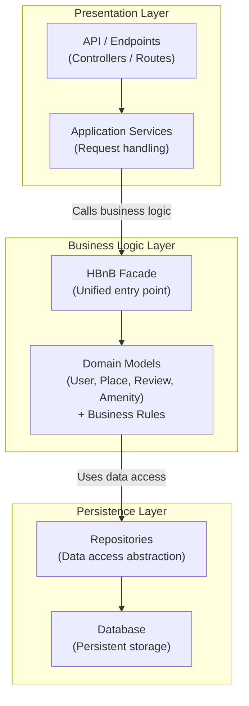

```mermaid
flowchart TB

%% ===============================
%% PRESENTATION LAYER
%% ===============================
subgraph P["Presentation Layer"]
  direction TB
  API["API / Endpoints\n(Controllers / Routes)"]
  SERVICE["Application Services\n(Request handling)"]
  API --> SERVICE
end


%% ===============================
%% BUSINESS LOGIC LAYER
%% ===============================
subgraph B["Business Logic Layer"]
  direction TB
  FACADE["HBnB Facade\n(Unified entry point)"]
  MODELS["Domain Models\n(User, Place, Review, Amenity)\n+ Business Rules"]
  FACADE --> MODELS
end


%% ===============================
%% PERSISTENCE LAYER
%% ===============================
subgraph D["Persistence Layer"]
  direction TB
  REPOSITORY["Repositories\n(Data access abstraction)"]
  DATABASE["Database\n(Persistent storage)"]
  REPOSITORY --> DATABASE
end


%% ===============================
%% LAYER DEPENDENCIES
%% ===============================

SERVICE -->|Calls business logic| FACADE
MODELS -->|Uses data access| REPOSITORY
```

